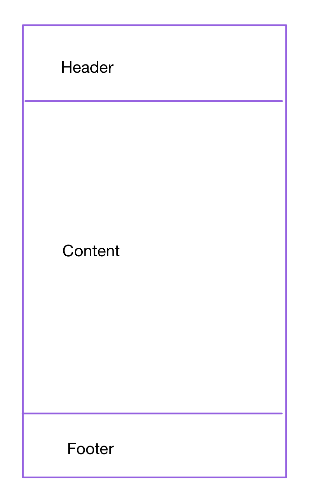

# Online Shopping Mall Project

---

A project to create an online shopping mall site using React/Redux that allows users to register, add to cart, delete, or purchase simple products.

## Lecture 01 - Create React with Vite

---

npm init vite

Setting directories and files structure.

## Lecture 02 - Setting Vite ESlint

---

npm i -D vite-plugin-eslint eslint eslint-config-react-app

[frontend/vite.config.js]

```js
import { defineConfig } from "vite";
import react from "@vitejs/plugin-react";
import eslint from "vite-plugin-eslint"; //add

// https://vitejs.dev/config/
export default defineConfig({
	plugins: [react(), eslint()], //add eslint()
});
```

[frontend/.eslintrc.cjs]

```js
module.exports = {
	root: true,
	env: { browser: true, es2020: true },
	extends: [
		"eslint:recommended",
		"plugin:react/recommended",
		"plugin:react/jsx-runtime",
		"plugin:react-hooks/recommended",
		"react-app", // add
	],
	ignorePatterns: ["dist", ".eslintrc.cjs"],
	parserOptions: { ecmaVersion: "latest", sourceType: "module" },
	settings: { react: { version: "18.2" } },
	plugins: ["react-refresh"],
	rules: {
		"react/jsx-no-target-blank": "off",
		"react-refresh/only-export-components": [
			"warn",
			{ allowConstantExport: true },
		],
	},
};
```

## Lecture 03 - TailWidCSS

---

TailWindCSS : Tailwind CSS is a utility-first CSS framework for rapidly building custom user interfaces. Unlike traditional CSS frameworks that provide predefined components and styles, Tailwind CSS provides low-level utility classes that let you build custom designs without writing any CSS.

extention - TailWindCSS IntelliSense

npm install -D tailwindcss postcss autoprefixer
npx tailwindcss init -p

[tailwind.config.js]

```js
/** @type {import('tailwindcss').Config} */
export default {
	content: ["./index.html", "./src/**/*.{js,ts,jsx,tsx}"], // add
	theme: {
		extend: {},
	},
	plugins: [],
};
```

[index.css]

```js
@tailwind base; //add
@tailwind components;//add
@tailwind utilities;//add

:root {
    ...
```

## Lecture 04 - React Router DOM & React Router DOM APIs

---

- What is 'React Router Dom'? - React Router DOM is a popular library used for handling routing in React applications. It allows developers to create single-page applications with navigation, and without the need to refresh the whole page.

- The React Router DOM allows you to implement dynamic routing in your web app. Unlike traditional routing architectures, where routing is handled in a configuration outside of the running app, the React Router DOM facilitates component-based routing based on the requirements of the app and platform.

- Because React is a Single Page Application (SPA), it has a single index.js template. Other components are added to this template using JavaScript to change the page.
  At this point, the React Router DOM library helps to route/navigate and render the new components.

* npm install react-router-dom
* <BrowserRouter>

[EXAMPLE]

```js
// App.js
import React from "react";
import { BrowserRouter as Router, Route, Switch } from "react-router-dom";
import Home from "./Home";
import About from "./About";
import Contact from "./Contact";

function App() {
	return (
		<Router>
			<div>
				<Switch>
					<Route path="/" exact component={Home} />
					<Route path="/about" component={About} />
					<Route path="/contact" component={Contact} />
				</Switch>
			</div>
		</Router>
	);
}

export default App;
```

- Components

* BrowserRouter: A router implementation that uses the HTML5 history API (pushState, replaceState and the popstate event) to keep your UI in sync with the URL.
* Route: It renders some UI when its path matches the current URL.
* Switch: It renders the first child <Route> or <Redirect> that matches the location.

- Example Components

* Here are simple implementations for the Home, About, and Contact components
  [EXAMPLE]

```js
// Home.js
import React from 'react';

const Home = () => {
  return <h2>Home</h2>;
};

export default Home;

// About.js
import React from 'react';

const About = () => {
  return <h2>About</h2>;
};

export default About;

// Contact.js
import React from 'react';

const Contact = () => {
  return <h2>Contact</h2>;
};

export default Contact;

```

- Navigation

* To navigate between these routes, you can use the Link component
  [EXAMPME]

```js
// Navbar.js
import React from "react";
import { Link } from "react-router-dom";

const Navbar = () => {
	return (
		<nav>
			<ul>
				<li>
					<Link to="/">Home</Link>
				</li>
				<li>
					<Link to="/about">About</Link>
				</li>
				<li>
					<Link to="/contact">Contact</Link>
				</li>
			</ul>
		</nav>
	);
};

export default Navbar;
```

- Routes :

* Container/parent role for all individual routes that will be created in the app.
* It will render the first matching Route among the child components created by Route.

- Route :

* Used to create a single route.
* It takes two attributes

1. path: Specifies the URL path of the desired component.
2. element/component: Specifies the component that should be rendered to match the path.

- Link: The Link component is similar to the anchor element (<a />) in HTML.

1. The to attribute specifies the path the link takes.

- Nested Routes : Nested routes are routes that are defined within the scope of another route. This allows you to have hierarchical routing structures.

[EXAMPME]

```js
// App.js
import React from "react";
import { BrowserRouter as Router, Route, Routes } from "react-router-dom";
import Home from "./Home";
import About from "./About";
import Contact from "./Contact";
import Dashboard from "./Dashboard";

function App() {
	return (
		<Router>
			<Routes>
				<Route path="/" element={<Home />} />
				<Route path="about" element={<About />} />
				<Route path="contact" element={<Contact />} />
				<Route path="dashboard/*" element={<Dashboard />} />
			</Routes>
		</Router>
	);
}

export default App;
```

- Outlet : The <Outlet> component is used within a parent route to render the child routes.

[EXAMPLE]

```js
// Dashboard.js
import React from "react";
import { Outlet } from "react-router-dom";

const Dashboard = () => {
	return (
		<div>
			<h2>Dashboard</h2>
			<Outlet />
		</div>
	);
};

export default Dashboard;
```

- useNavigate : The useNavigate hook is used to programmatically navigate to different routes within your application.

[EXAMPLE]

```js
import React from "react";
import { useNavigate } from "react-router-dom";

const MyComponent = () => {
	const navigate = useNavigate();

	const handleClick = () => {
		// Navigate to a different route
		navigate("/dashboard");
	};

	return (
		<div>
			<h2>MyComponent</h2>
			<button onClick={handleClick}>Go to Dashboard</button>
		</div>
	);
};

export default MyComponent;
```

- useParams : The useParams hook allows you to access the parameters of the current route. For example, if your route is defined as /users/:id, you can use useParams to access the id parameter.

[EXAMPLE]

```js
import React from "react";
import { useParams } from "react-router-dom";

const UserProfile = () => {
	const { id } = useParams();

	return (
		<div>
			<h2>User Profile</h2>
			<p>User ID: {id}</p>
		</div>
	);
};

export default UserProfile;
```

- useLocation : he useLocation hook is provided by React Router v6 to access the current location object, which represents the current URL. It returns an object with properties such as pathname, search, hash, state, and key.

[EXAMPLE]

```js
import React from "react";
import { useLocation } from "react-router-dom";

const MyComponent = () => {
	const location = useLocation();

	return (
		<div>
			<h2>Current Location</h2>
			<p>Pathname: {location.pathname}</p>
			<p>Search: {location.search}</p>
			<p>Hash: {location.hash}</p>
			{/* You can also access the state property if you passed state using the navigate method */}
			{/* <p>State: {location.state && JSON.stringify(location.state)}</p> */}
		</div>
	);
};

export default MyComponent;
```

- pathname represents the path of the current URL.
- search represents the query parameters of the current URL.
- hash represents the hash fragment of the current URL.
- state represents any state that might have been passed to the current location object (if applicable).

* useRoutes : In React Router v6, useRoutes is a hook that allows you to define nested routes dynamically based on a configuration object. It's useful for more complex routing setups where you want to programmatically define routes.

[EXAMPLE]

```js
import React from "react";
import { BrowserRouter as Router, useRoutes } from "react-router-dom";

const routes = [
	{
		path: "/",
		element: <Home />,
		children: [
			{ path: "about", element: <About /> },
			{ path: "contact", element: <Contact /> },
		],
	},
	{ path: "dashboard/*", element: <Dashboard /> },
];

function App() {
	const routing = useRoutes(routes);

	return <Router>{routing}</Router>;
}

export default App;
```

- The routes array contains an array of route objects. Each route object has a path property representing the URL path, an element property representing the component to render when the route matches, and optionally a children property for nested routes.
- The useRoutes hook is called with the routes array to generate the routing configuration.
- The routing variable returned from useRoutes is then rendered within the <Router> component.

* Dynamic Routing : You can generate routes dynamically based on conditions or data.
  [EXAMPLE]

```js
const items = [
	{ id: 1, name: "Item 1" },
	{ id: 2, name: "Item 2" },
	{ id: 3, name: "Item 3" },
];

const routes = items.map((item) => ({
	path: `item/${item.id}`,
	element: <ItemDetail item={item} />,
}));
```

- This will generate routes like /item/1, /item/2, /item/3, etc., each rendering the ItemDetail component with the corresponding item.

* Redirects and Not Found Routes : You can also include redirects and not found routes in the routes array
  [EXAMPLE]

```js
const routes = [
	{ path: "/", element: <Home /> },
	{ path: "about", element: <About /> },
	{ path: "contact", element: <Contact /> },
	{ path: "dashboard/*", element: <Dashboard /> },
	{ path: "login", element: <Login /> },
	{ path: "profile", element: <Profile />, authRequired: true },
	{ path: "logout", element: <Logout /> },
	{ path: "*", element: <NotFound /> },
];
```

- The '\*' path matches any route that hasn't been matched by previous routes, serving as a catch-all for not found routes.
- You can also conditionally render certain routes based on authentication status or other conditions, as shown with the authRequired property.

** Applying real-world programs **

1. install reacr-router-dom
   -> npm install react-router-dom

2. [src/main.jsx] - add/change code

```js
import React from "react";
import ReactDOM from "react-dom/client";
import App from "./App.jsx";
import "./index.css";
import { BrowserRouter } from "react-router-dom"; //add

ReactDOM.createRoot(document.getElementById("root")).render(
	// change
	<BrowserRouter>
		<App />
	</BrowserRouter> // change
);
```

3. [src/App.jsx] add/change code

```js
import { Route, Routes, Outlet } from "react-router-dom";
// import "./App.css";

import LandingPage from "./pages/LandingPage";
import LoginPage from "./pages/LoginPage";
import RegisterPage from "./pages/RegisterPage";
import NavBar from "./layout/NavBar";
import Footer from "./layout/Footer";

// import NotAuthRoutes from "./components/NotAuthRoutes";
// import ProtectedRoutes from "./components/ProtectedRoutes";
// import UploadProductPage from "./pages/UploadProductPage";
// import DetailProductPage from "./pages/DetailProductPage";
// import CartPage from "./pages/CartPage";
// import HistoryPage from "./pages/HistoryPage";

function Layout() {
	return (
		<div>
			<NavBar />
			<main>
				<Outlet />
			</main>
			<Footer />
		</div>
	);
}

function App() {
	return (
		<Routes>
			<Route path="/" element={<Layout />}>
				{/* without Login */}
				<Route path="/" element={<LandingPage />} />
				<Route path="/login" element={<LoginPage />} />
				<Route path="/register" element={<RegisterPage />} />

				{/* with Login */}
				{/* <Route element={<ProtectedRoutes />}>
					<Route path="product/upload" element={<UploadProductPage />} />
					<Route path="product/:productId" element={<DetailProductPage />} />
					<Route path="user/cart" element={<CartPage />} />
					<Route path="history" element={<HistoryPage />} />
				</Route> */}
			</Route>
		</Routes>
	);
}

export default App;
```

## Lecture 05 - CSS Structure & React Icons

---



1. CSS structure
   [src/App.jsx]

```js
function Layout() {
	return (
		<div className="flex flex-col h-screen justify-between">
			<NavBar />
			<main className="mb-auto w-10/12 max-w-4xl mx-auto">
				<Outlet />
			</main>
			<Footer />
		</div>
	);
}
```

2. React Icons

- npm install react-icons
  [src/Footer]

```js
import React from "react";
import { AiOutlineSmile } from "react-icons/ai";

const Footer = () => {
	//change
	return (
		//style
		<div className="flex h-20 text-lg justify-center items-center">
			All right reserved.
			<AiOutlineSmile />
		</div>
	);
};

export default Footer;
```

## Lecture 06 - Redux & Redux-Persist

---

- Prepare for using Redux

1. npm install @reduxjs/toolkit react-redux

- Redux Toolkit provides utilities to simplify Redux development, and React Redux allows you to connect your React components with the Redux store.

2. [src/store/userSlice.js]

```js
import { createSlice } from "@reduxjs/toolkit";

const initialState = {
	userData: {
		id: "",
		email: "",
		name: "",
		role: 0,
		image: "",
	},
	isAuth: false,
	isLoading: false,
	error: "",
};

const userSlice = createSlice({
	name: "user",
	initialState,
	reducers: {},
	extraReducers: (buider) => {},
});

export default userSlice.reducer;
```

This file defines a Redux slice using createSlice from Redux Toolkit.
It sets the initial state for the user slice, including userData, isAuth, isLoading, and error.
The reducers and extraReducers sections are currently empty. They would contain reducer functions and extra reducers for handling actions and updating the state.

3. [src/store/index.js]

```js
import { configureStore } from "@reduxjs/toolkit";
import userReducer from "./userSlice";

export const store = configureStore({
	reducer: {
		user: userReducer,
	},
});
```

This file creates the Redux store using configureStore from Redux Toolkit.
It imports the user reducer from userSlice.js.
The user reducer is added to the store under the key user.

4. [src/main.jsx]

```js
import React from "react";
import ReactDOM from "react-dom/client";
import App from "./App.jsx";
import "./index.css";
import { BrowserRouter } from "react-router-dom";
import { Provider } from "react-redux";
import { store } from "./store";

ReactDOM.createRoot(document.getElementById("root")).render(
	<BrowserRouter>
		<Provider store={store}>
			<App />
		</Provider>
	</BrowserRouter>
);
```

This file is the entry point of your React application.
It sets up the Redux store to be provided to all components using the Provider component from React Redux.
The <BrowserRouter> component wraps the entire application, enabling React Router functionality.
ReactDOM.createRoot().render() method is used to render the root component (<App />) into the HTML element with the id "root". This is the modern approach for rendering in React 18 and above.

- Redux-Persist
- Redux Persist is a library that helps persist the Redux state to the local storage or any other storage mechanism. It's commonly used in Redux applications, especially in combination with React, to maintain the state even after a page refresh or when the user navigates away from the application.

1. npm install redux-persist
2. [src/store/index.js]

```js
import { configureStore } from "@reduxjs/toolkit";
import userReducer from "./userSlice";
import storage from "redux-persist/lib/storage";
import {
	FLUSH,
	REHYDRATE,
	PAUSE,
	PERSIST,
	PURGE,
	REGISTER,
	persistReducer,
	persistStore,
} from "redux-persist";

// Combine all the reducers into one rootReducer.
export const rootReducer = combineReducers({
	user: userReducer, // Add the userReducer to the rootReducer.
});

// Configuration object for redux-persist.
const persistConfig = {
	key: "root", // Key for the persisted data in storage.
	storage, // Storage engine to use (default storage in this case).
};

// Create a persisted reducer using the persistConfig and rootReducer.
const persistedReducer = persistReducer(persistConfig, rootReducer);

// Configure the Redux store with the persisted reducer and customized middleware.
export const store = configureStore({
	reducer: persistedReducer, // Use the persisted reducer.
	middleware: (getDefaultMiddleware) =>
		getDefaultMiddleware({
			serializableCheck: {
				ignoreActions: [FLUSH, REHYDRATE, PAUSE, PERSIST, PURGE, REGISTER],
			},
		}),
});

// Create a persistor object for the store.
export const persistor = persistStore(store);
```

3. [src/main.jsx]

```js
import React from "react";
import ReactDOM from "react-dom/client";
import App from "./App.jsx";
import "./index.css";
import { BrowserRouter } from "react-router-dom";
import { Provider } from "react-redux";
import { persistor, store } from "./store";
import { PersistGate } from "redux-persist/integration";

ReactDOM.createRoot(document.getElementById("root")).render(
	<BrowserRouter>
		<Provider store={store}>
			<PersistGate loading={null} persistor={persistor}>
				<App />
			</PersistGate>
		</Provider>
	</BrowserRouter>
);
```

## Lecture 07 - Backend simple setting

---

1. npm init
2. npm install express
3. npm install -D nodemone

- express : Express.js is a minimal and flexible Node.js web application framework that provides a robust set of features to develop web and mobile applications. It simplifies the process of creating a server and handling requests and responses.

- nodemon : Nodemon is a utility that helps develop Node.js applications by automatically restarting the node application when file changes in the directory are detected. It is a tool that significantly enhances the developer experience by eliminating the need to manually stop and restart the server every time you make changes to your code.

4. When you send an API request from the client side to the backend, it is received in an entry file called index.js.

[backend/src/index.js]

```js
const express = require("express");

//constants
const PORT = 4000;
const app = express();

//Showing on localhost:4000
app.get("/", (req, res) => {
	res.send("Hello, World!");
});

//Mark on Terminal
app.listen(PORT, () => {
	console.log("PORT is running on 4000 now.");
});
```

5. Diretories structure
   src/middleware/auth.js
   /models/User.js
   /routes/users.js
   uploads
   .env
   .gitignore

6. npm install bcryptjs cors dotenv jsonwebtoken mogoose

7. bcryptjs
   bcryptjs is a library used for hashing passwords in a secure way. It provides methods to create hashes and to compare a given password with its hash. This is useful for storing passwords securely in a database.

8. cors
   cors (Cross-Origin Resource Sharing) is a middleware used in Express.js applications to enable or restrict requested resources on a web server depending on where the HTTP request was initiated. It is used to allow or deny cross-origin requests.

9. dotenv
   dotenv is a module that loads environment variables from a .env file into process.env. This is useful for managing configuration settings separately from the source code.

10. jsonwebtoken
    jsonwebtoken is a library for creating and verifying JSON Web Tokens (JWT). JWTs are commonly used for authentication and secure data exchange.

11. mongoose
    mongoose is an Object Data Modeling (ODM) library for MongoDB and Node.js. It provides a straightforward, schema-based solution to model your application data.

## Lecture 08 - express.static()

---

- The express.static() function is a built-in middleware function in Express.js that serves static files, such as HTML files, images, CSS files, and JavaScript files. This middleware is useful for serving assets that do not change dynamically, allowing you to deliver these files to the client's browser directly.

[backend/src/index.j]

```js
const express = require("express");
const path = require("path");

//constants
const PORT = 4000;
const app = express();

app.get("/", (req, res) => {
	res.send("Hello, World!");
});

//Use absolute paths to be accessible from any path
app.use(express.static(path.join(__dirname, "../uploads")));

app.listen(PORT, () => {
	console.log(`PORT is running on ${PORT}now.`);
});
```

## Lecture 09 - cors

---

- CORS : CORS, which stands for Cross-Origin Resource Sharing, is a security feature implemented by web browsers to control how web applications interact with resources from different origins. It helps prevent potentially malicious websites from accessing resources on another domain without permission.

- How CORS Works
  When a web application makes a request to a resource from a different origin (domain, protocol, or port), the browser will first send an HTTP request known as a "preflight" request. This preflight request uses the HTTP method OPTIONS and checks if the actual request is safe to send. The server's response to this preflight request includes specific headers that indicate whether the actual request is allowed.

- Key Concepts

* Same-Origin Policy (SOP): A security measure that restricts how documents and scripts loaded from one origin can interact with resources from another origin. CORS relaxes this restriction under specific conditions.
* Preflight Request: A CORS request made with the OPTIONS method to determine whether the actual request is safe to send.
* Access-Control-Allow-Origin: A response header that specifies which origins are allowed to access the resource.

[backend/src/index.js]

```js
const cors = require("cors"); //add

app.use(cors()); // add
```

## Lecture 10 - Express.json()

---

- Express.json() : What is express.json()?
  express.json() is a middleware function in Express.js that parses incoming request bodies in JSON format. This functionality has been built into Express since version 4.16.0 and replaces the need for the body-parser module.

- Key Concepts

* JSON Parsing: The express.json() middleware automatically parses the request body as a JSON object when the Content-Type header is set to application/json, and stores it in req.body.
* Middleware Usage: Using app.use(express.json()) allows JSON body parsing for all routes. For specific routes, you can apply it directly.

[backend/src/index.js]

```js
app.use(express.json()); //add

//example
app.post("/", (req, res) => {
	console.log(req.body);
	res.json(req.body);
});
```

- Why JSON Body Parsing is Necessary

* RESTful API: RESTful APIs often exchange data in JSON format. When a client sends JSON data to the server, the server needs to parse and use it.
* Data Processing: To process or store data in a database, the server needs to convert JSON data into JavaScript objects.

* express.json() is a useful middleware that automatically parses JSON formatted request bodies, making it easier to handle JSON data in Express applications. It plays an essential role in modern web applications, especially when dealing with RESTful APIs that process JSON data.

## Lecture 11 - MongoDB & Mongoose

---

- MondoDB : MongoDB is a NoSQL database that stores data in a flexible, JSON-like format called BSON (Binary JSON). It is designed to handle large volumes of data, scale out easily, and provide high availability. Unlike traditional relational databases that use tables and rows, MongoDB uses collections and documents to manage data, allowing for a more flexible schema design.

* Key Features of MongoDB

1. Document-Oriented Storage: Stores data as JSON-like documents.
2. Schema Flexibility: Documents in the same collection can have different fields.
3. Scalability: Easily scales out horizontally using sharding.
4. High Availability: Supports replication for data redundancy and failover.
5. Powerful Query Language: Rich query language for filtering and manipulating data.
6. Indexing: Supports various types of indexes to improve query performance.

- Basic MongoDB Concepts

* Database: A container for collections.
* Collection: A group of MongoDB documents, similar to a table in relational databases.
* Document: A single record in a collection, represented in BSON format.
* Field: A key-value pair in a document.

- Mongoose : Mongoose is an Object Data Modeling (ODM) library for MongoDB and Node.js. It provides a straight-forward, schema-based solution to model your application data. Mongoose manages relationships between data, provides schema validation, and is used to translate between objects in code and the representation of those objects in MongoDB.

* Key Features of Mongoose

1. Schema Definition: Mongoose allows you to define schemas for your collections, specifying the structure of the documents.
2. Validation: You can define custom validation rules for your schemas to ensure data integrity.
3. Middleware: Mongoose supports middleware (also known as pre and post hooks) for various lifecycle events, such as saving or deleting documents.
4. Type Casting: Automatically converts data types to match your schema.
5. Query Building: Provides a more readable and chainable API for building queries.
6. Plugins: Mongoose has a flexible plugin system to extend its capabilities.

Connect MongoDB with Server

1. npm install mongoose
2. [backend/src/index.js]

```js
const mongoose = require("mongoose"); //add
const dotenv = require("dotenv"); //add

dotenv.config(); //add

mongoose
	.connect(process.env.MONGO_URI)
	.then(() => {
		console.log("connect success");
	})
	.catch((err) => {
		console.log(err);
	});
```

3. [backend/.env]
   MONGO_URI=link address

[Hide id and password for security problem]

## Lecture 12 - Create Model & Schema

---

- Model : A model is a compiled version of the schema. It provides the interface to interact with the database, enabling you to create, read, update, and delete (CRUD) documents within the MongoDB collection that the model represents.

* Key Points about Model

- Instance Creation: Allows you to create instances of documents.
- CRUD Operations: Provides methods to perform CRUD operations.
- Querying: Enables querying the database with various conditions and filters.
- Instance Methods: Uses methods defined on the schema for document instances.
- Static Methods: Uses static methods defined on the schema for the model itself.

- Schema : In Mongoose (and many other ODM/ORM libraries), a schema is a blueprint or a structure for defining the shape and structure of documents within a MongoDB collection. It outlines the fields and their types, as well as validation rules, default values, and other configurations for the data.

* Key Points about Schema

- Structure: Defines the fields and types of data to be stored in a collection.
- Validation: Specifies validation rules to ensure data integrity.
- Defaults: Can set default values for fields if none are provided.
- Indexing: Allows you to create indexes to optimize query performance.
- Methods: Can define custom instance methods for documents.
- Stat: Can define static methods for the model.

1. Create Schema

[backend/src/models/User.js]

```js
const { default: mongoose } = require("mongoose");

//Schema
const userSchema = mongoose.Schema({
	name: {
		type: String,
		maxLength: 50,
	},
	email: {
		type: String,
		trim: true,
		unique: true,
	},
	password: {
		type: String,
		minLength: 5,
	},
	role: {
		trype: Number,
		default: 0,
	},
	image: String,
});

const User = mongoose.model("User", userSchema); //model

module.exports = User; //export for using
```

## Lecture 13 - Handling Error in Express

---

```js
app.use((error, req, res, next) => {
	res.send(error.message);
});
```

-> This middleware function is designed to handle errors that occur in the application. Here’s what happens step-by-step:

1. If an error occurs in any of the routes or other middleware, it can be passed to this error-handling middleware by calling next(error) in the previous middleware.
2. This middleware catches the error and sends the error message as the response to the client.

** If you handle errors caused by asynchronous requests in this way, the server will crash because the error handler cannot receive error messages. **

Then ?

```js
app.use((error, req, res, next) => {
	// res.send(error.message);
	res.status(500).send(error.message);
});
```

or

```js
app.use((error, req, res, next) => {
	res.status(500).send("Internal Server Error");
});
```

or

```js
app.use((error, req, res, next) => {
	console.error(error.stack); // Log the error stack trace
	res.status(500).send("Internal Server Error");
});
```

## Lecture 14 - Implemeting Login function

---

### 01. Register page UI

[frontend/src/pages/RegisterPage/index.jsx]
Using tailswind css and html

### 02. React-Hook-Form

- Leveraging React-hooks for validation checks

What is 'Validation Checks'? : a process used to ensure that data or inputs meet specific criteria or rules before they are processed or accepted. Validation checks are commonly used in various contexts, such as data entry, software development, and form submissions, to ensure the accuracy, consistency, and reliability of the data being handled.

1. npm install react-hook-form
2. [frontend/src/pages/RegisterPage/index.jsx]

```js
const {
	register,
	handleSubmit,
	formState: { errors },
	reset,
} = useForm({ mode: "onChange" });

const onSubmit = ({ email, password, name }) => {
	reset();
};

const userEmail = {
	required: "Required field",
};

const userName = {
	required: "Required field",
};

const userPassword = {
	required: "Required field",
	minLength: {
		value: 6,
		message: "Password must be at least 6 characters.",
	},
};

<input
	type="email"
	id="email"
	className="w-full px-4 py-2 mt-2 bg-white border rounded-md"
	{...register("email", userEmail)}
/>;
{
	errors.email && (
		<div>
			<span className="text-red-500">{errors.email.message}</span>
		</div>
	);
}
```

### 03. Axios instance

- What is Axios? : Axios is a popular JavaScript library used to make HTTP requests from the browser or Node.js. It is often used in web development to interact with APIs, fetch data from a server, send data to a server, and perform other HTTP operations. Axios is known for its simplicity, ease of use, and ability to handle requests and responses with promises.

- Key Features of Axios

* Promise-Based: Axios uses promises, which makes it compatible with modern JavaScript features like async and await for handling asynchronous operations more easily.

* Request and Response Interception: You can intercept requests or responses before they are handled by then or catch.

* Automatic Transformations: Axios automatically transforms JSON data, making it easier to work with the responses from APIs.

* Error Handling: It provides robust error handling features that allow you to handle errors gracefully.

* Cancellation: You can cancel requests using the CancelToken API.

* CSRF Protection: Axios provides support for Cross-Site Request Forgery (CSRF) protection.

* Client-Side Support: Works well in both browser and Node.js environments.

1. npm install axios
2. [frontend/src/utils/axios.js]

- Reasons for Instantiating Axios

1. Managing Default Settings: By creating an Axios instance, you can centralize and manage default settings such as base URL, headers,
2. Interceptor Configuration: Interceptors allow you to perform middleware-like functions before requests are sent or responses are handled. This is useful for tasks like adding authentication tokens to requests or globally handling error responses.
3. Reusability: With Axios instances, you can reuse specific API clients across different modules or components of your application. This reduces code duplication and maintains consistency.
4. Multiple Instances: If you need multiple API clients with different configurations (e.g., different base URLs or headers), you can create separate Axios instances for each.

### 04. Creact Register function

1. [frontend/src/index.jsx]

```js
import { useDispatch } from "react-redux";
import { registerUser } from "../../store/thunkFunction";

const dispatch = useDispatch();

const onSubmit = ({ email, password, name }) => {
	const body = {
		email,
		password,
		name,
		image: `https://via.placeholder.com/600x400?text=no+user+image`,
	};
	dispatch(registerUser(body));
	reset();
};
```

2. [frontend/src/store/thunkFunction.js]

```js
import { createAsyncThunk } from "@reduxjs/toolkit";
import axiosInstance from "../utils/axios";

export const registerUser = createAsyncThunk(
	"user/registerUser",

	async (body, thunkAPI) => {
		try {
			const response = await axiosInstance.post(`/users/register`, body);
			return response.data;
		} catch (error) {
			console.log(error);
			return thunkAPI.rejectWithValue(error.response.data || error.message);
		}
	}
);
```

3. [frontend/src/store/userSlice.js]

```js
import { registerUser } from "./thunkFunction";

const userSlice = createSlice({
	name: "user",
	initialState,
	reducers: {},
	extraReducers: (builder) => {
		builder
			.addCase(registerUser.pending, (state) => {
				state.isLoading = true;
			})
			.addCase(registerUser.fulfilled, (state) => {
				state.isLoading = false;
			})
			.addCase(registerUser.rejected, (state, action) => {
				state.isLoading = false;
				state.error = action.payload;
			});
	},
});
```

### 05. Using react toast

- What is react-toast? : React Toast is a popular way to display notifications or alerts in a React application. It provides a simple and user-friendly interface to show temporary messages to the user, often used to indicate success, error, warning, or informational messages. Several libraries offer toast notifications for React, with react-toastify being one of the most popular options.

1. npm install react-toastify
2. [frontend/src/App.jsx]

```js
import { ToastContainer } from "react-toastify";
import "react-toastify/dist/ReactToastify.css";

<ToastContainer
	position="bottom-right"
	theme="light"
	pauseOnHover
	autoClose={1500}
/>;
```

3. [frontend/src/store/userSlice.js]

```js
import { toast } from "react-toastify";

...
.addCase(registerUser.fulfilled, (state) => {
	state.isLoading = false;
	toast.info("Sing up success."); // add
})
.addCase(registerUser.rejected, (state, action) => {
	state.isLoading = false;
	state.error = action.payload;
	toast.error(action.payload); //add
});
...
```

### 06. Create register route

[backend/src/index.js]

```js
app.use("/users", require("./routes/users"));
```

- Purpose: This line of code registers a middleware in the Express application to handle routes that start with /users.
- Interaction: When a request is made to any URL that starts with /users, the Express application will forward that request to the router defined in ./routes/users.js.

[backend/src/routes/users.js]

```js
//imports the Express module - allows to use express functionalities in this file
const express = require("express");
// Creates a new router object -
const router = express.Router();

//Defines a route handler for POST requests to /users/register.
router.post("/register", async (req, res) => {
	//Error handling within the route.
	try {
		//Creates a new instance of the User model.
		const user = new User(req.body);
		//Saves the user to the database.
		await user.save();
		//Sends a response with HTTP status code 200.
		return res.sendStatus(200);
	} catch (error) {
		//Handles any errors that occur during the execution of the try block.
		console.log(error);
		//Passes the error to the next middleware, typically an error-handling middleware.
		next(error);
	}
});

module.exports = router;
```

- Interaction between 'index.js' and 'users.js' : - When a POST request is made to /users/register, the middleware registered in index.js intercepts the request.

* The index.js file uses the router defined in users.js to handle this request.
* The router in users.js processes the request, tries to create and save a new user, and sends an appropriate response back to the client.
* If any errors occur, they are handled and passed along to any error-handling middleware.

\*\* ERROR
app.use("/users", require("./routes/users")); -> ERROR
' throw new TypeError('Router.use() requires a middleware function but got a ' + gettype(fn))

TypeError: Router.use() requires a middleware function but got a undefined'

CHANGE TO
const usersRouter = require("./routes/users");
app.use("/users", usersRouter);

Both app.use("/users", require("./routes/users")); and const usersRouter = require("./routes/users"); app.use("/users", usersRouter); achieve the same goal of mounting the usersRouter middleware at the /users endpoint in your Express application. However, there are subtle differences in how they work and are typically used:

1. Inline require Syntax:
   'app.use("/users", require("./routes/users"));'

- Description: In this syntax, require("./routes/users") directly loads and executes the users.js file. The returned value from require("./routes/users") is immediately passed as a parameter to app.use().
- Usage: This approach is concise and often used when you want to inline the require statement directly within the app.use() call without assigning it to a variable.

2. Separate require and app.use:
   'const usersRouter = require("./routes/users");
   app.use("/users", usersRouter); '

- Description: Here, const usersRouter = require("./routes/users"); assigns the exported module from users.js to the variable usersRouter. Then, app.use("/users", usersRouter); uses the usersRouter variable as the middleware to be mounted at /users.
- Usage: This approach separates the loading of the router module from its mounting, which can be useful for readability and if you need to reuse the usersRouter variable elsewhere in your application.

* Key Considerations:

- Readability and Maintenance: Using a separate require statement and app.use() call can make your code easier to read, especially if you have multiple middleware or want to reuse the router in different parts of your application.

- Performance: Both methods have negligible differences in performance since require caches modules after the first load, so subsequent calls to require for the same module are fast.

- Error Handling: If there are errors during module loading (e.g., require fails to find the file), handling them might differ slightly between the two approaches, although in practical scenarios, this difference is minimal.

- When inlined, it would be ' throw new TypeError('Router.use() requires a middleware function but got a ' + gettype(fn))
  TypeError: Router.use() requires a middleware function but got a undefined'
  Why did I get this error and it disappeared when I wrote delimited code? : The error 'Router.use() requires a middleware function but got a undefined' typically occurs in Express when it expects a middleware function but receives undefined instead. This happens when the routing setup or middleware usage is not correctly defined

When you encounter this error, it often points to issues such as:

1. Typographical Errors or Incorrect Route Paths:
   If the route path specified in app.use("/users", require("./routes/users")) does not match the actual path defined in your router file (./routes/users), Express cannot find the middleware function it needs.

2. Middleware Function Definition Problems:
   If the function exported by require("./routes/users") does not properly export a middleware function that Express can use, it may result in undefined being passed instead of a valid middleware function.

3. Module Loading Issues:
   Sometimes, due to module loading problems or incorrect export statements, the imported module may not be what Express expects, leading to undefined being passed as a middleware.

To resolve this issue, using a separate variable to store the imported router module (const usersRouter = require("./routes/users")) and then passing it explicitly to app.use() (app.use("/users", usersRouter)) helps to ensure that Express correctly identifies and uses the middleware function provided by the router module. This approach enhances code clarity and reduces the likelihood of undefined being passed inadvertently as a middleware function.

Therefore, the reason the error disappeared when using separate, explicitly defined variables for require() and app.use() is because it ensures Express correctly interprets the router module as a middleware function, avoiding the issues associated with inline require() usage where evaluation errors can occur unexpectedly.

### 07. Encrypting password

When storing user information in the data, unencrypted passwords are still being stored. This situation is not good for security, so you should encrypt and store passwords.

There are three main ways to encrypt

1. save the original password as is -> the worst way.

2. encrypting the password with the encryption key (two-way): encrypting the password with any password and decrypting it with the encryption key -> if the encryption key is exposed, the algorithm is mostly open, so there is a high risk of security threats.

3. Hash and store (one-way): Password cannot be decrypted, -> You can create a rainbow table to compare encrypted passwords to find out the password.

Workaround: Give salt a random value and save the hashed value with a new value.

### 08. Enforce password encryption at signup

In the userSchema we created earlier, we have a pre method that allows us to run this part of the userSchema before storing the password. This will allow us to salt and hash the password before it is stored as-is and make it secure.

1. npm install bcryptjs
2. [backend/src/models/User.js]

```js
//add after Schema

userSchema.pre("save", async function (next) {
	let user = this;
	if (user.isModified("password")) {
		const salt = await bcrypt.genSalt(10);
		const hash = await bcrypt.hash(user.password, salt);
		user.password = hash;
	}
	next();
});
```

### 09. Create Login Page

1. Create UI - Same as Register page [copy/paste and edit]

[frontend/src/LoginPage/index.jsx]

2. thunkFunction - loginUser function implement
   [frontend/src/store/thunkFunction.js]

```js
//payload creator
export const loginUser = createAsyncThunk(
	"user/loginUser", // type prefix

	async (body, thunkAPI) => {
		try {
			const response = await axiosInstance.post(
				`/user/login`, //end point
				body // email, password
			);
			return response.data; //Passing data from the backend
		} catch (error) {
			console.error(error);
			return thunkAPI.rejectWithValue(error.response.data || error.message);
		}
	}
);
```

3. The value you send as response.data in the thunkFunction comes into the userSlice as action.payload.
   [frontend/src/store/userSlice.js]

```js
.addCase(loginUser.pending, (state) => {
				state.isLoading = true;
			})
			.addCase(loginUser.fulfilled, (state) => {
				state.isLoading = false;
				state.userData = action.payload; //Data from backend
				state.inAuth = true;
				localStorage.setItem("accessToken", action.payload.accessToken);
			})
			.addCase(loginUser.rejected, (state, action) => {
				state.isLoading = false;
				state.error = action.payload;
				toast.error(action.payload);
			});
```

### 10. Why authentication is required

- Knowledge required to implement authentication services

* HTTP is a stateless protocol, meaning each request from a client to a server is independent; the server does not retain any information about previous requests. Each request contains all the information the server needs to fulfill that request.

* Managing State in Stateless HTTP
  While HTTP itself is stateless, web applications often need to manage state to provide a consistent user experience, such as remembering user login status, maintaining shopping cart contents, or tracking user preferences. This state management is achieved using various techniques:

1. Cookies
   Cookies are small pieces of data stored on the client's browser and sent with each request to the server.

Example:

```http
Set-Cookie: sessionId=abc123; Expires=Wed, 09 Jun 2021 10:18:14 GMT
```

Usage: Store session identifiers, user preferences, or authentication tokens.

2. Sessions
   Sessions store data on the server, with a unique session identifier sent to the client (often in a cookie). The server uses this identifier to retrieve the stored session data.

Example (Express.js with session middleware):

```js
const session = require("express-session");
app.use(
	session({
		secret: "mySecret",
		resave: false,
		saveUninitialized: true,
		cookie: { secure: true },
	})
);
```

Usage: Track user login status, store temporary data across multiple requests.

3. Tokens (e.g., JWT)
   Tokens, like JSON Web Tokens (JWT), are another method to manage state. The server generates a token containing user information, which is then sent to the client. The client includes the token in subsequent requests, and the server validates it.

Example:

```js
const jwt = require("jsonwebtoken");
const token = jwt.sign({ userId: user.id }, "secretKey", { expiresIn: "1h" });
```

Usage: Authentication and authorization, where the
token contains user credentials or roles.

### 11. About JWT

- What is JWT (JSON Web Token)?
  JSON Web Token (JWT) is an open standard (RFC 7519) for securely transmitting information between parties as a JSON object. It is compact, self-contained, and can be used for secure data exchange. JWTs can be signed using a secret (with the HMAC algorithm) or a public/private key pair using RSA or ECDSA.

- Structure of JWT
  A JWT is composed of three parts, separated by dots (.):

1. Header : The header typically consists of two parts: the type of the token, which is JWT, and the signing algorithm being used, such as HMAC SHA256 or RSA.
2. Payload : The payload contains the claims. Claims are statements about an entity (typically, the user) and additional data. There are three types of claims: registered, public, and private claims.

- Registered claims: Predefined claims which are not mandatory but recommended to provide a set of useful, interoperable claims. Some examples are iss (issuer), exp (expiration time), sub (subject), and aud (audience).

- Public claims: Claims that are public and can be defined at will by those using JWTs. However, to avoid collisions, they should be defined in the IANA JSON Web Token Registry or be defined using a collision-resistant namespace.

- Private claims: Custom claims created to share information between parties that agree on using them.

3. Signature : To create the signature part, you have to take the encoded header, the encoded payload, a secret, and the algorithm specified in the header, and sign that.

- How JWT Works

1. Client requests for a token: The client authenticates with the server using their credentials (e.g., username and password). The server verifies the credentials and issues a JWT.

2. Client stores the token: The JWT is sent to the client and can be stored in local storage, session storage, or a cookie.

3. Client sends the token: The client includes the JWT in the Authorization header of subsequent requests to the server.

4. Server verifies the token: The server extracts and verifies the JWT using the secret or public key. If the token is valid, the server processes the request. If not, the server rejects the request.

- Benefits of JWT
  1. Compact: JWTs are compact, making them easy to send in URLs, POST parameters, or inside HTTP headers.
  2. Self-contained: JWTs contain all the necessary information about the user, eliminating the need to query the database multiple times.
  3. Security: The payload of a JWT is securely signed, ensuring data integrity and authenticity.

### 12. Create login route

1. [backend/src/routes/users.js]

```js
router.post("/login", async (req, res, next) => {
	try {
		const user = await User.findOne({ email: req.body.email });

		if (!user) {
			return res.status(400).send("This user does not exist.");
		}

		const isMatch = await user.comparePassword(req.body.password);
		if (!isMatch) {
			return res.status(400).send("The passwords don't match.");
		}

		const payload = {
			userId: user._id.toHexString(),
		};

		const accessToken = jwt.sign(payload, process.env.JWT_SECRET, {
			expiresIn: "1h",
		});

		return res.json({ user, accessToken });
	} catch (error) {
		console.error(error);
		next(error);
	}
});
```

2. [backend/src/Models/User.js]

```js
userSchema.methods.comparePassword = async function (plainPassword) {
	let user = this;
	const match = await bcrypt.compare(plainPassword, user.password);
	return match;
};
```

### 13. Check to see if user is authenticated

The part that checks if the user is accessing with a valid token.

1. [frontend/src/App.jsx]

```js
function App() {
	const dispatch = useDispatch();
	const isAuth = useSelector((state) => state.user?.isAuth);
	const { pathname } = useLocation();
	useEffect(() => {
		if (isAuth) {
			dispatch(authUser());
		}
	}, [isAuth, pathname, dispatch]);
	...
```

2. [thunkFunction.js]

```js
export const authUser = createAsyncThunk(
	"user/authUser",
	async (_, thunkAPI) => {
		try {
			const response = await axiosInstance.get(`/users/autgh`);
			return response.data;
		} catch (error) {
			console.error(error);
			return thunkAPI.rejectWithValue(error.response.data || error.message);
		}
	}
);
```

3. [utils/axios.js]

```js
axiosInstance.interceptors.request.use(
	function (config) {
		// The request is sent with a 'Bearer' token as Authorization in the request header.
		config.headers.Authorization =
			"Bearer " + localStorage.getItem("accessToken");
		return config;
	},
	function (error) {
		return Promise.reject(error);
	}
);
```

4. [backend/src/routes/users.js]

```js
router.get("auth", auth, (req, res) => {
	return res.status(200).json({
		_id: req.user._id,
		email: req.user.email,
		name: req.user.name,
		role: req.user.role,
		image: req.user.image,
		cart: req.user.cart,
		history: req.user.history,
	});
});
```

5. [backend/src/middleware/auth.js]

```js
const jwt = require("jsonwebtoken");
const User = require("../models/User");

let auth = async (req, res, next) => {
	//get token from request headers
	const authHeader = req.headers["authorization"];

	//Bearer
	const token = authHeader && authHeader.split(" ")[1];
	if (token === null) {
		return res.sendStatus(401);
	}

	try {
		const decode = jwt.verify(token, process.env.JWT_SECRET);
		const user = await User.findOne({ _id: decode.userId });

		if (!user) {
			return res.status(400).send("This user does not exist.");
		}
	} catch (error) {
		console.error(error);
		next(error);
	}
};
```

6. Put the json data from the router into state.userData and adjust the state for each situation
   [store/userSlice.js]

```js
//adding
.addCase(authUser.pending, (state) => {
	state.isLoading = true;
})
.addCase(authUser.fulfilled, (state, action) => {
	state.isLoading = false;
	state.userData = action.payload;
	state.isAuth = true; //login state true/false
})
.addCase(authUser.rejected, (state, action) => {
	state.isLoading = false;
	state.error = action.payload;
	state.isAuth = false;
	localStorage.removeItem("accessToken");
});
```

### 14. NotAuthRoutes, ProtectedRoutes

Make it possible to differentiate which pages are accessible based on whether you're logged in, etc.

0. [App.jsx]

```js
<Routes>
	<Route path="/" element={<Layout />}>
		<Route path="/" element={<LandingPage />} />

		{/* with Login only */}
		<Route element={<ProtectedRoutes isAuth={isAuth} />}>
			<Route path="/protected" element={<ProtectedPage />} />
		</Route>

		{/* without Login only */}
		<Route element={<NotAuthRoutes isAuth={isAuth} />}>
			<Route path="/login" element={<LoginPage />} />
			<Route path="/register" element={<RegisterPage />} />
		</Route>
```

1. ProtectedRoutes : What you need to make accessible to people who aren't logged in when they log in

[components/ProtectedRoutes.jsx]

```js
import React from "react";
import { Navigate, Outlet } from "react-router-dom";
import PropTypes from "prop-types";

const ProtectedRoutes = ({ isAuth }) => {
	return isAuth ? <Outlet /> : <Navigate to={"/login"} />;
};

ProtectedRoutes.propTypes = {
	isAuth: PropTypes.bool.isRequired,
};
export default ProtectedRoutes;
```

2. NotAuthRoutes : What you need to block access when a logged-in person tries to access the signup or login page

[components/NotAuthRoutes.jsx]

```js
import React from "react";
import { Navigate, Outlet } from "react-router-dom";
import PropTypes from "prop-types";

const NotAuthRoutes = ({ isAuth }) => {
	return isAuth ? <Navigate to={"/"} /> : <Outlet />;
};

NotAuthRoutes.propTypes = {
	isAuth: PropTypes.bool.isRequired,
};

export default NotAuthRoutes;
```

### 15. NavBar

```js
import React, { useState } from "react";
import { Link } from "react-router-dom";
import NavItem from "./Sections/NavItem";

const NavBar = () => {
	const [menu, setMenu] = useState(false);

	const handleMenu = () => {
		setMenu(!menu);
	};
	return (
		<section className="relativ z-10 text-white bg-gray-900">
			<div className="w-full">
				<div className="flex items-center justify-between mx-5 sm:mx-10 lg:mx-20">
					{/* logo */}
					<div className="flex items-center text-2xl h-14">
						<Link to="/"> Logo</Link>
					</div>

					{/* menu button */}
					<div className="text-2xl sm:hidden">
						<button onClick={handleMenu}>{menu ? "-" : "+"}</button>
					</div>

					{/* big screen nav-items  */}
					<div className="hidden sm:block">
						<NavItem />
					</div>
				</div>

				{/* moobile size nav-items */}
				<div className="block sm:hidden">{menu && <NavItem mobile />}</div>
			</div>
		</section>
	);
};

export default NavBar;
```

### 16. NavBar Item

1. [Login / Register /Logout] - routes implement

[layout/NavBar/Sections/NavItem.jsx]

```js
import React from "react";
import PropTypes from "prop-types";
import { useDispatch, useSelector } from "react-redux";
import { Link, useNavigate } from "react-router-dom";
import { logoutUser } from "../../../store/thunkFunction";
// import { AiOutlineShoppingCart } from "react-icons/ai";
// import { useRouteId } from "react-router/dist/lib/hooks";

const routes = [
	{ to: "/login", name: "Sign In", auth: false },
	{ to: "/register", name: "Sign Up", auth: false },
	{ to: "", name: "Logout", auth: true },
];

const NavItem = ({ mobile }) => {
	const isAuth = useSelector((state) => state.user?.isAuth);

	const dispatch = useDispatch();
	const navigate = useNavigate();

	const handleLogout = async () => {
		try {
			dispatch(logoutUser()).then(() => {
				navigate("/login");
			});
		} catch (error) {
			console.error(error);
		}
	};

	return (
		<ul
			className={`text-md justify-center w-full flex gap-4 ${
				mobile && "flex-col bg-gray-900 h-full"
			} items-center`}
		>
			{routes.map(({ to, name, auth }) => {
				if (isAuth !== auth) return null;

				if (name === "Logout") {
					return (
						<li
							key={name}
							className="py-2 text-center border-b-4 cursor-pointer"
						>
							<Link onClick={handleLogout}>{name}</Link>
						</li>
					);
				}
				//  else if (icon) {

				//  }
				else {
					return (
						<li
							key={name}
							className="py-2 text-center border-b-4 cursor-pointer"
						>
							<Link to={to} key={name}>
								{name}
							</Link>
						</li>
					);
				}
			})}
		</ul>
	);
};

NavItem.propTypes = {
	mobile: PropTypes.bool.isRequired,
};

export default NavItem;
```

[thunkFunction.js]

```js
export const logoutUser = createAsyncThunk(
	"user/logoutUser",
	async (_, thunkAPI) => {
		try {
			const response = await axiosInstance.post(`/users/logout`);
		} catch (error) {
			console.log(error);
			return thunkAPI.rejectWithValue(error.response.dataa || error.message);
		}
	}
);
```

[usesrSlice.js]

```js
			.addCase(logoutUser.pending, (state) => {
				state.isLoading = true;
			})
			.addCase(logoutUser.fulfilled, (state, action) => {
				state.isLoading = false;
				state.userData = initialState.userData;
				state.isAuth = false;
				localStorage.removeItem("accessToken");
			})
			.addCase(logoutUser.rejected, (state, action) => {
				state.isLoading = false;
				state.error = action.payload;
				toast.error(action.payload);
			});
```

### 17. Handling token expiration

The current code generates a token at login, which is valid for 1 hour. (optional)
So after 1 hour, the token expires and can't be used, and if you do something like log out after the token expires, you'll get the error JWT expired.

What can we do to fix this?

1. issue a refresh token at the same time as login and renew the access token.

2. use axios.Instance.interceptors to reload when error.response.data is 'jwt expired'

[frontend/src/utils/axios.js]

```js
axiosInstance.interceptors.response.use(
	function (response) {
		return response;
	},
	function (error) {
		if (error.response.data === "jwt expired") {
			window.location.reload();
		}
		return Promise.reject(error);
	}
);
```

- Setting an expiration time on tokens is important for several reasons, including security, resource management, and session control.

1. Enhanced Security
   Preventing Token Misuse: If a token is leaked or intercepted, an attacker could potentially use it indefinitely. By setting an expiration time, the token will only be valid for a limited period, reducing the risk of long-term misuse.
2. Resource Management
   Efficient Resource Use: Tokens that never expire can lead to increased load on the server, as the server has to keep track of these tokens indefinitely. Expiring tokens help manage and free up server resources.
3. Session Management
   User Session Control: Setting an expiration time allows for better control over user sessions. This ensures that users need to re-authenticate after a certain period, which can be useful for applications requiring a higher level of security.
4. Compliance
   Regulatory Requirements: Some industries and regulations require that user sessions and authentication tokens have a maximum lifespan to protect user data and ensure secure access.
5. User Convenience
   Improved User Experience: Expiring tokens can help manage stale sessions and prompt users to re-login, ensuring they have a fresh and secure session, especially in applications where users might stay logged in for long periods.

## Lecture 15 - Implemeting Product creation, main page Function

---

### 1. Adding source code for the Shop app

1. add to pages [CartPage, DetailProductPage, OrdersPage, UploadProductPage]

2. [App.jsx]

```js
import UploadProductPage from "./pages/UploadProductPage";
import DetailProductPage from "./pages/DetailProductPage";
import CartPage from "./pages/CartPage";
import OrdersPage from "./pages/OrdersPage";

<Route path="/product/upload" element={<UploadProductPage />} />
<Route path="/product/:productId" element={<DetailProductPage />} />
<Route path="/user/cart" element={<CartPage />} />
<Route path="/Orders" element={<HistoryPage />} />
```

3. adding Models [products, payments]

- products : Product-by-product data

- payments : Ordered records

[models/User.js]

```js
const userSchema = mongoose.Schema({
	...
	cart: {
		type: Array,
		default: [],
	},
	orders: {
		type: Array,
		default: [],
	},
	...
```

[models/Product.js]

```js
const { default: mongoose } = require("mogoose");

const productSchema = mongoose.Schema({
	writer: {
		type: Schema.Types.ObjectId,
		ref: "User",
	},
	title: {
		type: String,
		maxLength: 30,
	},
	description: String,
	price: {
		type: Number,
		default: 0,
	},
	images: {
		type: Array,
		default: [],
	},
	sold: {
		type: Number,
		default: 0,
	},
	continents: {
		type: Number,
		default: 1,
	},
	views: {
		type: Number,
		default: 0,
	},
});

productSchema.index(
	{
		title: "text",
		description: "text",
	},
	{
		weights: {
			title: 5,
			description: 1,
		},
	}
);

const Product = mongoose.model("Product", productSchema);

module.exports = Product;
```

[models/Payment.js]

```js
const { default: mongoose } = require("mogoose");

const paymentSchema = mongoose.Schema(
	{
		user: {
			type: Object,
		},
		data: {
			type: Array,
			default: [],
		},
		product: {
			type: Array,
			default: [],
		},
	},
	{ timestamps: true }
);

const Payment = mongoose.model("Payment", paymentSchema);

module.exports = Payment;
```

4. adding
   [NavItems.js]

```js

{ to: "/product/upload", name: "Upload", auth: true },
{
to: "/user/cart",
name: "Cart",
auth: true,
icon: <AiOutlineShoppingCart style={{ fontSize: "1.4rem" }} />,
},
{ to: "/orders", name: "Orders", auth: true },


else if (icon) {
	return (
		<li
			className="relative py-2 text-center border-b-4 cursor-pointer"
			key={name}
		>
			<Link to={to}>
				{icon}
				<span className="absolute top-0 inline-flex items-center justify-center w-4 h-4 text-xs font-bold text-white border-2 border-white rounded-full -right-3">
					{cart ? cart.length : 0}
				</span>
			</Link>
		</li>
	);
```

5. route add
   [routes/users.js]

```js
	cart: req.user.cart,
	orders: req.user.orders,
});
```

frontend - npm install react-dropzone react-image-gallery react-responsive-carousel

backend - npm install async multer

### 2. Create the product upload page UI

### 3. Creating the product upload page functionality

### 4. Creating a file upload component

### 5. Uploading files using Multer

### 6. Creating a landing page

### 7. Creating a Route to fetch product data

### 8. Creating a More feature

### 9. Creating a checkbox filter feature

### 10. Create a rainbow filter feature

### 11. Creating a search feature
